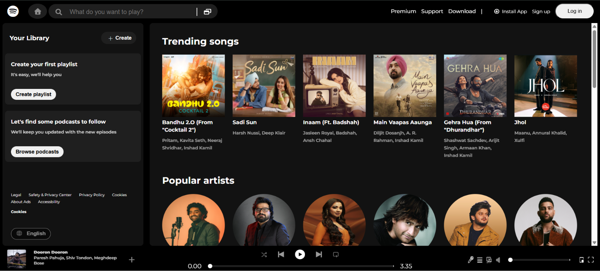
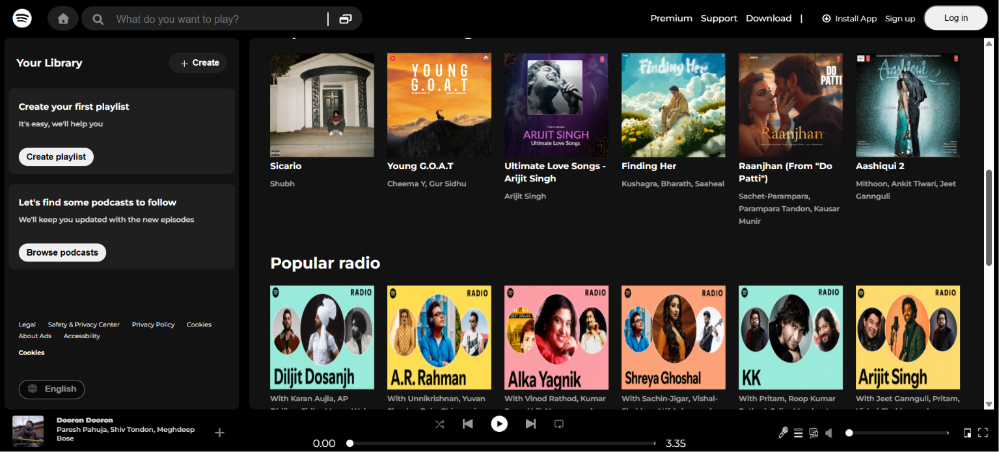
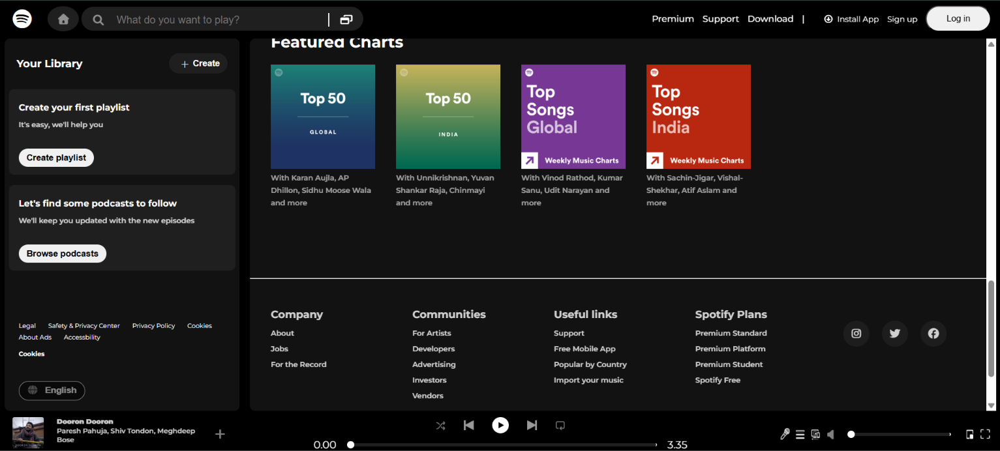

# 🎵 Spotify Clone

A responsive Spotify-inspired web interface built using HTML, CSS, and Bootstrap. This project focuses on recreating Spotify's user interface while improving frontend development skills.

## 📸 Project Preview







## 🚀 Features

- Responsive layout
- Sidebar navigation
- Top navigation bar
- Playlist cards
- Music player UI
- Clean and modern interface

## 🛠️ Technologies Used

- HTML5
- CSS3
- Bootstrap 5

## 📂 Folder Structure

```text
Spotify-Clone/
│── assets/
│── images/
│   ├── Screenshot-1.png
│   ├── Screenshot-2.png
│   └── Screenshot-3.png
│── index.html
│── style.css
│── README.md
```

## 🎯 Learning Outcome

This project helped me practice responsive web design, CSS layouts, Flexbox, and Bootstrap while recreating Spotify's user interface.

## 👩‍💻 Author

**Manya Sharma**
